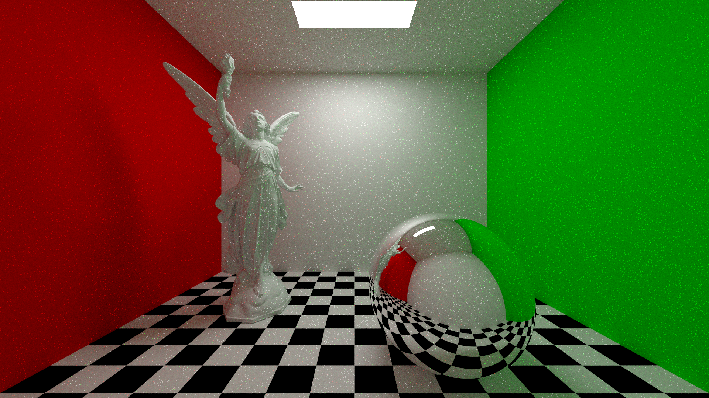

# Haruno Renderer

Haruno is a physically-based unidirectional path tracer, capable of rendering realistic images by performing light transport simulation and handling global illumination.



## Features

* Unbiased
* Support for Area Lights
* Next Event Estimation (direct light sampling)
* Importance Sampling BRDFs
* Russian Roulette
* Multithreader
* Basic support for OBJ triangle meshes 
* Pinhole and thin lens cameras
* Additional integrators: direct lighting, ambient occlusion, normals, albedo, depth

### Preparation

Haruno uses minimal amount of dependencies, one of which is a [googletest](https://github.com/google/googletest) library, used to write some basic unit tests. This library is included as a git submodule so before building the application run following command to initialize it:  

```
$ git submodule update --init
```

For loading and storing images, Sean Barrett's header-only [stb-image](https://github.com/nothings/stb) library is used and it is included with project's source code.

### Build

Project can be build using CMake 3.10 or newer:

```console
$ cmake .
$ make -j8
```

### Run

```console
$ ./haruno
```

### Test

Some unit tests are provided and are being build alongside main application. To execute them simply run:

```console
$ ./test
```

